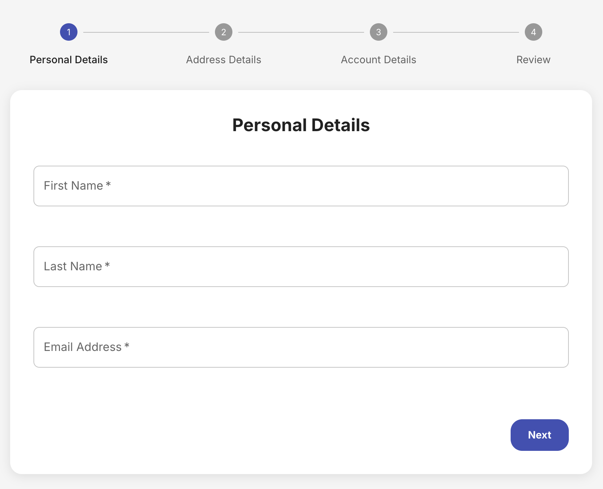

# Multi Step Registration Task

A modern, responsive user registration flow built with Next.js, TypeScript, Zustand, and Material-UI.

## [View Demo](https://multi-step-registration-khaki.vercel.app/)



## 🚀 Features

- Multi-step user registration process
- Form validation using Zod
- State management with Zustand
- Responsive design with Material-UI
- TypeScript for type safety

## 📋 Requirements

- Node.js 18.x or later
- npm or yarn

## 🛠️ Installation

1. Clone the repository:
   ```bash
   git clone https://github.com/d1amooond/multi-step-registration.git
   cd multi-step-registration
   ```

2. Install dependencies:
   ```bash
   npm install
   # or
   yarn install
   ```

3. Run the development server:
   ```bash
   npm run dev
   # or
   yarn dev
   ```

4. Open [http://localhost:3000](http://localhost:3000) with your browser to see the result.

### Project Structure

The application follows a clean, modular architecture:

- `/app`: Next.js app directory with pages and layouts
- `/components`: UI components organized by functionality
- `/enums`: Typescript enums
- `/stores`: Data storage (zustand)
- `/types`: TypeScript type definitions
- `/utils`: Utility functions, helpers
